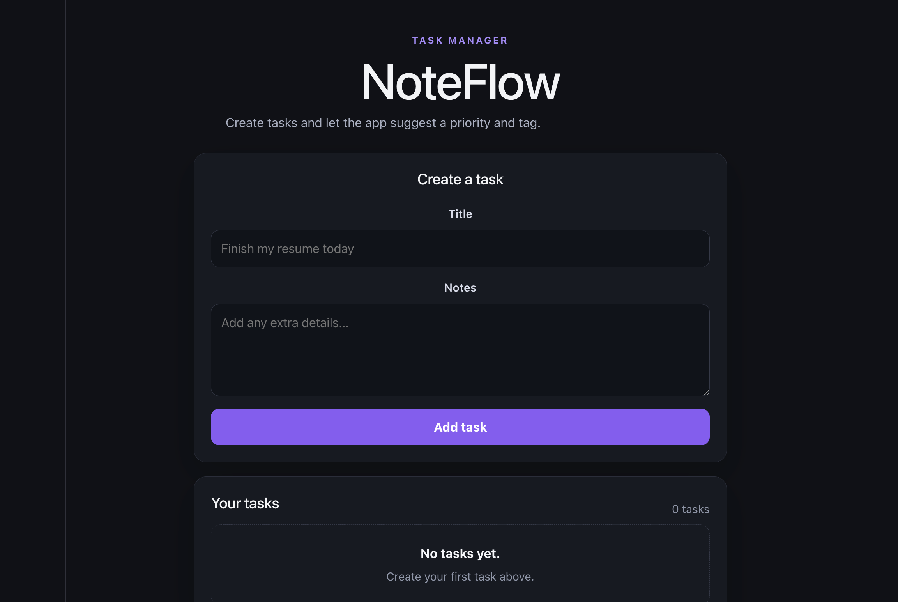
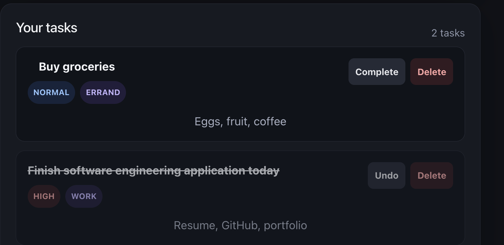

# NoteFlow

A full-stack task management application built with **React, TypeScript, FastAPI, GraphQL, SQLAlchemy, and Apollo Client**.

NoteFlow allows users to create, organize, complete, and manage tasks through a modern React interface backed by a FastAPI GraphQL server. The application includes a rule-based task classifier that automatically suggests task priorities and categories to help users organize their work more efficiently.


---

## Features

- GraphQL API built with Strawberry GraphQL
- Create, complete, and delete tasks
- Automatic priority suggestions
- Automatic task category suggestions
- Apollo Client integration
- Responsive React interface
- SQLAlchemy database integration
- Dockerized development environment
- Backend and frontend automated testing

---

## Tech Stack

### Frontend

- React
- TypeScript
- Apollo Client
- Vite
- CSS

### Backend

- FastAPI
- Strawberry GraphQL
- SQLAlchemy

### Database

- PostgreSQL for the application
- SQLite for isolated automated tests

### Task Classification

- Rule-based task prioritization
- Automatic task categorization

### Testing

- Pytest
- Vitest
- React Testing Library

### DevOps

- Docker
- Docker Compose

---

## Screenshots

### Dashboard

The main NoteFlow interface includes a task form and a section for displaying saved tasks.



### Automatic Priority and Category Suggestions

Tasks are automatically assigned a priority level and category based on their title and notes.


### Completed Tasks

Users can mark tasks as complete, undo completion, and delete tasks.



---

## Project Structure

```text
task-notes-app/
│
├── backend/
│   ├── app/
│   ├── tests/
│   ├── Dockerfile
│   └── requirements.txt
│
├── frontend/
│   ├── src/
│   ├── public/
│   └── package.json
│
├── screenshots/
│   ├── dashboard.png
│   ├── create-task.png
│   └── completed-task.png
│
├── docker-compose.yml
└── README.md
```

---

## API

The backend exposes a GraphQL endpoint:

```text
http://localhost:8000/graphql
```

Interactive queries and mutations can be explored using the built-in Strawberry GraphiQL interface.

---

## Running the Project

### Backend

```bash
cd backend
python -m venv venv
source venv/bin/activate
pip install -r requirements.txt
uvicorn app.main:app --reload
```

Backend URL:

```text
http://localhost:8000
```

GraphQL endpoint:

```text
http://localhost:8000/graphql
```

### Frontend

Open a second terminal:

```bash
cd frontend
npm install
npm run dev
```

Frontend URL:

```text
http://localhost:5173
```

Vite may use another port, such as `5174`, if port `5173` is already occupied.

---

## Running with Docker

From the project root:

```bash
docker compose up --build
```

This starts the backend and PostgreSQL services defined in `docker-compose.yml`.

---

## Testing

### Backend

From the `backend` folder:

```bash
pytest -v
```

The backend test suite includes:

- GraphQL task creation
- Task retrieval
- Task completion toggling
- Task deletion
- Priority classification
- Category classification

### Frontend

From the `frontend` folder:

```bash
npx vitest run --config vitest.config.ts
```

The frontend test suite includes:

- React component rendering
- NoteFlow heading validation
- Task form rendering
- Input and button validation

---

## Future Improvements

- User authentication
- Due dates
- Search functionality
- Drag-and-drop task ordering
- Task editing
- Production deployment
- Natural-language task creation
- Personalized user dashboards

---

## Author

**Lauren Stone**

GitHub: [github.com/llaurenstone](https://github.com/llaurenstone)

LinkedIn: [linkedin.com/in/llaurenstone](https://linkedin.com/in/llaurenstone)

---

